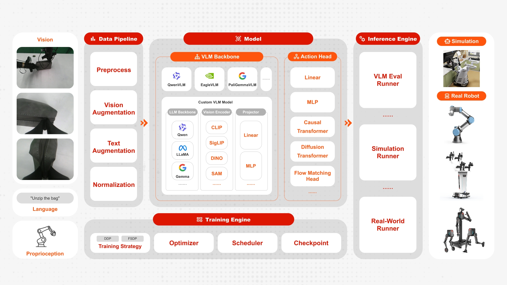
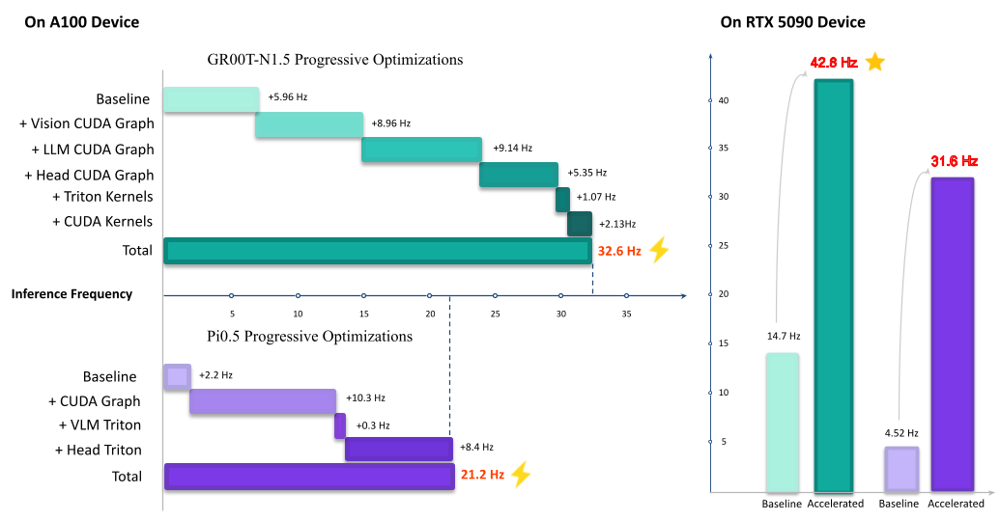

# FluxVLA Engine：具現知能向け「ワンストップ」の VLA エンジニアリング基盤

<p align="center">
  
</p>

<div align="center">
<a href="https://huggingface.co/limxdynamics/FluxVLAEngine"></a>
<a href="https://fluxvla.limxdynamics.com"></a>
<a href="https://fluxvla.limxdynamics.com/zh"></a>
<a href="https://github.com/limxdynamics/FluxVLA/issues/1"></a>
<a href="https://github.com/limxdynamics/FluxVLA/issues/1"></a>
</div>

<div align="center">

[English](README.md) | [簡体中文](README_zh-CN.md) | 日本語

</div>

FluxVLA Engine は、具現知能（Embodied Intelligence）の実運用を見据えた、エンドツーエンドの全チェーン一体型エンジニアリングプラットフォームです。統一設定、標準インターフェース、モジュール分離、デプロイ可能性を中核とした設計思想により、データから実機へのデプロイまでをつなぐ完全なエンジニアリング・クローズドループを構築します。また「標準化された産学研の基盤」を目標として、VLA 研究・開発におけるエンジニアリング上の参入障壁を大幅に引き下げます。

## フレームワーク

<p align="center">
  
</p>

## パフォーマンス

| Codebase                    | Libero-Spatial | Libero-Object | Libero-Goal | Libero-Long | Libero-Average |
| --------------------------- | -------------- | ------------- | ----------- | ----------- | -------------- |
| FluxVLA(GR00T)              | 96.4           | 93.8          | 93.6        | 83.5±1.5    | 91.8           |
| FluxVLA(Pi)                 | 99.4           | 99.4          | 98          | 96.8        | 98.4           |
| FluxVLA(Qwen3VL 0.6B+GR00T) | 98             | 99.2          | 95.2        | 87.2        | 94.9           |

## 最新情報

<!-- **[2026/04/03]** 🔥 FluxVLA をオープンソース化しました。 -->

## インストール

以下のインストール手順は NVCC 12.4 を例にしています。環境が異なる場合は、CUDA バージョンに応じて適宜調整してください。

<details>
<summary><b>1. conda 環境を作成する</b></summary>

```bash
conda create -n fluxvla python=3.10 -y
conda activate fluxvla
```

</details>

<details>
<summary><b>2. PyTorch（CUDA バージョン）をインストールする</b></summary>

> **重要**：`pip install -r requirements.txt` を実行する前に、必ず公式の CUDA インデックスから PyTorch を先にインストールしてください。デフォルトの PyPI インデックスでは CUDA 対応ビルドを取得できません。

```bash
pip install torch==2.6.0 torchvision==0.21.0 torchaudio==2.6.0 --index-url https://download.pytorch.org/whl/cu124
```

他の CUDA バージョンの場合は、`cu124` を該当する値（例：`cu118`、`cu121`）に置き換えてください。詳細は [https://pytorch.org/get-started/locally/](https://pytorch.org/get-started/locally/) を参照してください。

</details>

<details>
<summary><b>3. flash-attention をインストールする</b></summary>

方式 1：pip で直接インストール：

```bash
pip install psutil ninja packaging
# MAX_JOBS は並列ビルドのスレッド数を制御します。マシンのリソースに応じて調整してください
MAX_JOBS=8 pip install flash-attn==2.5.5 --no-build-isolation --find-links https://github.com/Dao-AILab/flash-attention/releases
```

方式 2：ソースからビルドしてインストール（方式 1 が失敗する場合に推奨）：

```bash
git clone https://github.com/Dao-AILab/flash-attention.git
cd flash-attention
git checkout v2.5.5
# MAX_JOBS は並列ビルドのスレッド数を制御します。マシンのリソースに応じて調整してください
MAX_JOBS=8 python setup.py install
```

</details>

<details>
<summary><b>4. av をインストールする</b></summary>

```bash
conda install -c conda-forge av=14.4.0
```

</details>

<details>
<summary><b>5. fluxvla とその他の依存関係をインストールする</b></summary>

```bash
pip install -r requirements.txt
pip install --no-build-isolation -e .
```

> **補足**：`requirements.txt` では `torch==2.6.0` を固定しています。これにより、2 番目の手順でインストールした CUDA 対応 PyTorch を pip が意図せず置き換えるのを防ぎます。別の torch バージョンを使う必要がある場合は、2 番目のコマンドと `requirements.txt` 内のバージョンの両方を更新してください。

</details>

<details>
<summary><b>オンライン評価環境（LIBERO / EGL）</b></summary>

レイトレーシング非対応のデバイス（例：A100）で LIBERO を評価したい場合は、[EGL Device GPU Rendering Configuration](https://github.com/google-deepmind/mujoco/issues/572#issuecomment-2419965230) を参照してください。

**システム依存関係のインストール**

```bash
export MUJOCO_GL=egl
sudo apt install libegl-dev libgl1-mesa-dev libx11-dev libglew-dev libosmesa6-dev
```

**環境チェック**

`/proc/1/environ` に以下の環境変数が含まれていることを確認してください：

- `NVIDIA_DRIVER_CAPABILITIES=all`
- `NVARCH=x86_64`
- `NVIDIA_REQUIRE_CUDA=cuda>=12.4`
- `brand=tesla` かつ `driver>=470`

**EGL 設定ファイルの作成**

`/usr/share/glvnd/egl_vendor.d/10_nvidia.json` を作成し、内容は以下の通りにしてください：

```json
{
    "file_format_version": "1.0.0",
    "ICD": {
        "library_path": "libEGL_nvidia.so.0"
    }
}
```

</details>

<details>
<summary><b>pre-commit フックの設定（任意だが推奨）</b></summary>

コードの品質と一貫性を担保するため（特に C++/CUDA コード）、pre-commit フックを導入することを推奨します：

```bash
pip install pre-commit
pre-commit install
```

これにより、コミット前に自動でコードのチェックとフォーマットが行われます。

</details>

<details>
<summary><b>Weights & Biases（wandb）の設定</b></summary>

[Weights & Biases](https://wandb.ai/) は、実験のトラッキングと可視化に使われます。設定手順は次の通りです：

1. wandb をインストール（`requirements.txt` に含まれています）：

```bash
pip install wandb
```

2. wandb アカウントにログイン：

```bash
wandb login
```

3. 環境変数を設定：

```bash
export WANDB_PROJECT=fluxvla        # プロジェクト名（デフォルト：fluxvla）
export WANDB_ENTITY=your-team-name  # チーム名またはユーザー名（デフォルト：None）
export WANDB_MODE=online            # online、offline、または disabled（デフォルト：online）
```

4. 学習時に wandb のログを無効化したい場合は、次を設定：

```bash
export WANDB_MODE=disabled
```

補足：すべての wandb 設定は環境変数から読み取られるため、設定ファイルに追加設定は不要です。

</details>

## データ準備

<details>
<summary><b>用意済みのデータをそのまま使う</b></summary>

必要なデータセットをダウンロードし、`./datasets` ディレクトリに配置してください。設定に応じて、必要なデータセットだけをダウンロードします。

| データセット           | ダウンロードリンク                                                                                                                                                     |
| ---------------------- | ---------------------------------------------------------------------------------------------------------------------------------------------------------------------- |
| libero-object          | [limxdynamics/FluxVLAData/libero_object_no_noops_lerobotv2.1](https://huggingface.co/datasets/limxdynamics/FluxVLAData/tree/main/libero_object_no_noops_lerobotv2.1)   |
| libero-spatial         | [limxdynamics/FluxVLAData/libero_spatial_no_noops_lerobotv2.1](https://huggingface.co/datasets/limxdynamics/FluxVLAData/tree/main/libero_spatial_no_noops_lerobotv2.1) |
| libero-10              | [limxdynamics/FluxVLAData/libero_10_no_noops_lerobotv2.1](https://huggingface.co/datasets/limxdynamics/FluxVLAData/tree/main/libero_10_no_noops_lerobotv2.1)           |
| libero-goal            | [limxdynamics/FluxVLAData/libero_goal_no_noops_lerobotv2.1](https://huggingface.co/datasets/limxdynamics/FluxVLAData/tree/main/libero_goal_no_noops_lerobotv2.1)       |
| modified_libero_rlds   | [openvla/modified_libero_rlds](https://huggingface.co/datasets/openvla/modified_libero_rlds)                                                                           |
| RealRobot_AgileX_aloha | [limxdynamics/FluxVLAData/RealRobot_AgileX_aloha_lerobot_v2](https://huggingface.co/datasets/limxdynamics/FluxVLAData/tree/main/RealRobot_AgileX_aloha_lerobot_v2)     |
| RealRobot_UR3_Chem     | [limxdynamics/FluxVLAData/RealRobot_UR3_Chem_lerobot_v2](https://huggingface.co/datasets/limxdynamics/FluxVLAData/tree/main/RealRobot_UR3_Chem_lerobot_v2)             |

例えば、`libero-10` データセットをダウンロードする場合：

```bash
huggingface-cli download limxdynamics/FluxVLAData --repo-type dataset --include "libero_10_no_noops_lerobotv2.1/*" --local-dir ./datasets
```

`libero_10_no_noops_lerobotv2.1` を、ダウンロードしたいデータセットに対応するフォルダ名に置き換えてください。

</details>

<details>
<summary><b>プライベートデータセットのディレクトリ構造</b></summary>

fluxvla をプライベートデータセットで学習する場合、まず生データ（例：ALOHA ロボットで収集した HDF5 ファイル）を LeRobot Dataset v2.1 形式に変換する必要があります。変換手順の詳細は [データ変換ガイド](docs/data_convert.md) をご覧ください。

変換後のデータセットのディレクトリ構造は次のとおりです：

```
├── data
│   └── chunk000
│   │   └── episode_000000.parquet
│   │   └── episode_000001.parquet
│   │   └── ...（さらに多くの parquet ファイル）
│   │   └── episode_00000N.parquet
│   └── chunk001
│   └── ...（さらに多くの chunk）
│   └── chunk00N
├── meta
│   └── episodes.jsonl
│   └── episodes_stats.jsonl
│   └── info.json
│   └── tasks.jsonl
├── videos
│   └── chunk000
│   │   └── camera name 0
│   │   │   └── episode_000000.mp4
│   │   │   └── episode_000001.mp4
│   │   │   └── ...（さらに多くの mp4 ファイル）
│   │   │   └── episode_00000N.mp4
│   │   └── camera name 1
│   └── chunk001
│   └── ...（さらに多くの chunk）
│   └── chunk00N
```

</details>

## チェックポイント準備

必要な事前学習済みチェックポイントをダウンロードし、`./checkpoints` ディレクトリに配置してください。設定に応じて必要なチェックポイントだけをダウンロードします。

<details>
<summary><b>VLA モデル</b></summary>

| モデル      | サイズ | ダウンロードリンク                                                                         |
| ----------- | ------ | ------------------------------------------------------------------------------------------ |
| GR00T N1.5  | 3B     | [🤗 Hugging Face](https://huggingface.co/nvidia/GR00T-N1.5-3B/tree/main)                   |
| OpenVLA     | 7B     | [🤗 Hugging Face](https://huggingface.co/openvla/openvla-7b-finetuned-libero-10)           |
| PI0_base    | 3B     | [🤗 Hugging Face](https://huggingface.co/limxdynamics/FluxVLAEngine/tree/main/pi0_base)    |
| PI05_base   | 3B     | [🤗 Hugging Face](https://huggingface.co/limxdynamics/FluxVLAEngine/tree/main/pi05_base)   |
| PI05_libero | 3B     | [🤗 Hugging Face](https://huggingface.co/limxdynamics/FluxVLAEngine/tree/main/pi05_libero) |

</details>

<details>
<summary><b>視覚言語モデル（VLM）</b></summary>

| モデル     | サイズ | ダウンロードリンク                                                    |
| ---------- | ------ | --------------------------------------------------------------------- |
| Qwen2.5-VL | 3B     | [🤗 Hugging Face](https://huggingface.co/Qwen/Qwen2.5-VL-3B-Instruct) |

</details>

<details>
<summary><b>大規模言語モデル（LLM）</b></summary>

| モデル   | サイズ | ダウンロードリンク                                                           |
| -------- | ------ | ---------------------------------------------------------------------------- |
| Qwen 2.5 | 3B     | [🤗 Hugging Face](https://huggingface.co/Qwen/Qwen2.5-3B)                    |
| Qwen 2.5 | 7B     | [🤗 Hugging Face](https://huggingface.co/Qwen/Qwen2.5-7B)                    |
| Llama 2  | 7B     | [🤗 Hugging Face](https://huggingface.co/meta-llama/Llama-2-7b-hf/tree/main) |

</details>

<details>
<summary><b>視覚バックボーンネットワーク</b></summary>

| モデル              | ダウンロードリンク                                                                   |
| ------------------- | ------------------------------------------------------------------------------------ |
| ViT-Large (DINOv2)  | [🤗 Hugging Face](https://huggingface.co/timm/vit_large_patch14_reg4_dinov2.lvd142m) |
| ViT-SO400M (SigLIP) | [🤗 Hugging Face](https://huggingface.co/timm/ViT-SO400M-14-SigLIP)                  |
| SigLIP2             | [🤗 Hugging Face](https://huggingface.co/google/siglip2-base-patch16-224)            |
| paligemma           | [🤗 Hugging Face](https://huggingface.co/google/paligemma-3b-pt-224)                 |

> **ヒント**：`huggingface-cli download <model-name> --local-dir ./checkpoints/<model-name>` を使うとダウンロードを高速化できます。

</details>

<details>
<summary><b>学習済みモデル</b></summary>

FluxVLA で学習済みのモデルもダウンロードして利用できます。推論や評価にそのまま使ってください。`./work_dirs` 配下に配置してください。

| モデル                    | ダウンロードリンク                                                                                                         |
| ------------------------- | -------------------------------------------------------------------------------------------------------------------------- |
| PI0.5 PaliGemma Libero-10 | [🤗 Hugging Face](https://huggingface.co/limxdynamics/FluxVLAEngine/tree/main/pi05_paligemma_libero_10_full_finetune_bs64) |
| GR00T Eagle 3B Libero-10  | [🤗 Hugging Face](https://huggingface.co/limxdynamics/FluxVLAEngine/tree/main/gr00t_eagle_3b_libero_10_full_finetune_bs64) |

```bash
# 例：limxdynamics/FluxVLAEngine から PI0.5 の checkpoint をダウンロード
huggingface-cli download limxdynamics/FluxVLAEngine --include "pi05_paligemma_libero_10_full_finetune_bs64/*" --local-dir ./checkpoints/pi05_paligemma_libero_10_full_finetune_bs64
```

</details>

## 特徴

<details>
<summary><b>All-in-one：1 つの設定ファイルで全工程を管理</b></summary>

- データ、モデル、学習、評価、推論、デプロイに必要な主要パラメータを 1 つの設定ファイルで統一管理できます（再現性とデプロイ性が向上します）。

</details>

<details>
<summary><b>異なる VLA モデルに対応</b></summary>

- OpenVLA、LlavaVLA、Gr00t、Pi0、Pi0.5 をサポートします。

</details>

<details>
<summary><b>異なるモジュールに対応</b></summary>

- Llama、Gemma、Qwen 系の LLM バックボーンをサポートします。
- DINOv2、SigLIP の視覚バックボーンをサポートします。
- PaliGemma、Qwen-VL の VLM バックボーンをサポートします。

</details>

<details>
<summary><b>異なる学習戦略に対応</b></summary>

- FSDP と DDP の併用に対応し、LoRA 学習モードもサポートします。
- train 後に即 eval（eval-after-train）に対応します。
- checkpoint から学習を再開できます。

</details>

<details>
<summary><b>データと重みのフォーマット</b></summary>

- Parquet データセットをサポートし、LeRobot 形式のデータも読み込み可能です。
- safetensors 形式のモデル重みをサポートします。

</details>

<details>
<summary><b>評価と推論の能力</b></summary>

- マルチ GPU 評価をサポートします。
- レイトレーシング非対応デバイスで libero を評価できます。
- [RTC（Real-Time Chunking）](docs/rtc.md) をサポートし、チャンク間の軌跡の連続性を向上させます。
- GR00T と PI0.5 の推論を高速化します。詳細は [Inference Acceleration](docs/inference_acceleration.md) を参照してください。Triton の融合カーネル、CUDA Graph のキャプチャ、CUDA のカスタム演算子が含まれます。

</details>

<p align="center">
  
</p>

## 使い方

<details>
<summary><b>ローカルデバッグ</b></summary>

```
/root/miniconda3/envs/fluxvla/bin/torchrun --standalone --nnodes 1 --nproc-per-node [NUM_GPUS] scripts/train.py --config [CONFIG_PATH] --work-dir [WORK_DIR] --cfg-options train_dataloader.per_device_batch_size=[PER_DEVICE_BATCH_SIZE]
```

例：

```
export WANDB_MODE=disabled
/root/miniconda3/envs/fluxvla/bin/torchrun --standalone --nnodes 1 --nproc-per-node 2 scripts/train.py --config configs/pi05/pi05_paligemma_libero_10_full_finetune.py --work-dir ./checkpoints/pi05_paligemma_libero_10_full_finetune --cfg-options train_dataloader.per_device_batch_size=2
```

</details>

<details>
<summary><b>ローカル評価</b></summary>

```
/root/miniconda3/envs/fluxvla/bin/torchrun --standalone --nnodes 1 --nproc-per-node [NUM_GPUS] scripts/eval.py --config [CONFIG_PATH] --ckpt-path [CKPT_PATH] --cfg-options [CFG_OPTIONS]
```

例：

```
export WANDB_MODE=disabled
/root/miniconda3/envs/fluxvla/bin/torchrun --standalone --nnodes 1 --nproc-per-node 2 scripts/eval.py --config configs/pi05/pi05_paligemma_libero_10_full_finetune.py --ckpt-path checkpoints/pi05_paligemma_libero_10_full_finetune_bs64/checkpoints/step-028548-epoch-18-loss=0.0111.safetensors
```

</details>

<details>
<summary><b>クラスター学習</b></summary>

```
export WANDB_MODE=disabled
bash scripts/train.sh [CONFIG] [WORK_DIR] --cfg-options train_dataloader.per_device_batch_size=[PER_DEVICE_BATCH_SIZE] train_dataloader.batch_size=[GLOBAL_BATCH_SIZE] runner.max_steps=[MAX_STEPS] runner.save_interval=[SAVE_INTERVAL] runner.max_keep_ckpts=[MAX_KEEP_CKPTS] --eval-after-train
```

</details>

<details>
<summary><b>checkpoint から学習を再開する</b></summary>

checkpoint から学習を再開するには、`--resume-from` パラメータで checkpoint ファイルのパスを指定します。学習は保存されている global step、epoch、モデル状態、最適化器状態から継続されます。

**ローカル学習の例：**

```
export WANDB_MODE=disabled
/root/miniconda3/envs/fluxvla/bin/torchrun --standalone --nnodes 1 --nproc-per-node 2 scripts/train.py \
  --config configs/pi05/pi05_paligemma_libero_10_full_finetune.py \
  --work-dir ./work_dirs/pi05_paligemma_libero_10_full_finetune \
  --resume-from ./work_dirs/pi05_paligemma_libero_10_full_finetune/checkpoints/checkpoint_epoch_5.pt \
  --cfg-options train_dataloader.per_device_batch_size=2
```

**クラスター学習の例：**

```
export WANDB_MODE=disabled
bash scripts/train.sh [CONFIG] [WORK_DIR] \
  --resume-from [CHECKPOINT_PATH] \
  --cfg-options train_dataloader.per_device_batch_size=[PER_DEVICE_BATCH_SIZE] runner.max_steps=[MAX_STEPS]
```

</details>

<details>
<summary><b>クラスター評価</b></summary>

```
export WANDB_MODE=disabled
bash scripts/eval.sh [CONFIG] [CKPT_PATH] --cfg-options [CFG_OPTIONS]
```

</details>

<details>
<summary><b>実ロボットでの推論</b></summary>

実機ロボット上で推論を実行する際は、まずロボット側で環境をセットアップし、その上で次のコマンドを実行してください：

```
python scripts/inference_real_robot.py --config [CONFIG] -- ckpt-path [CKPT_PATH]
```

</details>

## よくある質問（FAQ）

<details>
<summary><b>Q：モデルまたはデータセットのダウンロード時に Hugging Face へ接続できない。</b></summary>

<b>A：</b> Hugging Face の接続問題（ダウンロードが遅い、タイムアウト、接続拒否など）が発生する場合は、コマンド実行前に次の環境変数を設定し、[hf-mirror](https://hf-mirror.com) を利用してください：

```bash
export HF_ENDPOINT="https://hf-mirror.com"
```

</details>

<details>
<summary><b>Q：`conda install av` の環境解決が非常に遅い。</b></summary>

<b>A：</b>依存関係の解決を高速化するために `libmamba` ソルバを使えます：

```bash
conda install -c conda-forge av=14.4.0 --solver=libmamba
```

</details>

<details>
<summary><b>Q：LIBERO 上での GR00T の評価結果が不安定。</b></summary>

<b>A：</b>これは想定される挙動です。GR00T の LIBERO 上での性能は、乱数シード、ハードウェア環境、学習 epoch 数に敏感です。これらの要因の小さな変化でも、評価結果が大きく揺れる可能性があります。複数の乱数シードで実験し、評価結果に基づいて最適な checkpoint を選ぶことをおすすめします。

</details>

<details>
<summary><b>Q：`pip install -r requirements.txt` 実行時に `egl_probe` のビルドが失敗し、`RuntimeError: CMake must be installed` と表示される。</b></summary>

<b>A：</b> `egl_probe` はビルドに CMake が必要です。conda（推奨）または apt で CMake をインストールしてください：

```bash
conda install -c conda-forge cmake
# または
sudo apt install cmake
```

> **補足**：`pip install cmake` は使わないでください。pip の `cmake` は Python のラッパーであり、pip がビルド環境を分離するため失敗する可能性があります。

</details>

<details>
<summary><b>Q：`egl_probe` のビルドが失敗し、`Compatibility with CMake < 3.5 has been removed from CMake` と表示される。</b></summary>

<b>A：</b> これは通常、あなたの CMake バージョンが `egl_probe` の `CMakeLists.txt` に対して新しすぎることが原因です。インストール前に次の環境変数を設定してください：

```bash
CMAKE_POLICY_VERSION_MINIMUM=3.5 pip install -r requirements.txt
```

</details>

<details>
<summary><b>Q：インストール後に NumPy バージョンのエラーが出る（例：`RuntimeError: Numpy is not available` またはバージョン互換性警告）。</b></summary>

<b>A：</b> インストール中に一部の依存関係が固定された NumPy バージョンを書き換えることがあります。正しいバージョンを直接入れ直してください：

```bash
pip install numpy==1.26.4
```

</details>

<details>
<summary><b>Q：RTX 5090（推論）で失敗する（例：Triton カーネルのエラーや CUDA 互換性の問題）。</b></summary>

<b>A：</b> RTX 5090（Blackwell アーキテクチャ）は更新された Triton が必要です。Triton 3.2.0 以上にアップグレードしてください：

```bash
pip install triton==3.2.0
```

</details>

## サポート

本リポジトリを利用中に問題が発生した場合は、お気軽にご連絡ください。[mason@limxdynamics.com](mason@limxdynamics.com) と [wayne@limxdynamics.com](wayne@limxdynamics.com) まで直接お問い合わせいただくか、GitHub の issue からヘルプを依頼できます。

## 🙏 謝辞

本プロジェクトは、以下のオープンソースプロジェクトおよびコミュニティの活動から恩恵を受けています。心より感謝いたします：

- [LeRobot](https://github.com/huggingface/lerobot)
- [NVIDIA Isaac GR00T](https://github.com/NVIDIA/Isaac-GR00T/tree/main)
- [OpenVLA](https://github.com/openvla/openvla)
- [OpenPI (pi0)](https://github.com/Physical-Intelligence/openpi)
- [LLaVA](https://github.com/haotian-liu/LLaVA)
- [DeepSpeed](https://github.com/deepspeedai/DeepSpeed)
- [Qwen](https://github.com/QwenLM)
- [Triton](https://github.com/triton-lang/triton)
- [RTC](https://github.com/Physical-Intelligence/real-time-chunking-kinetix)
- [Training RTC](https://arxiv.org/pdf/2512.05964)
- [Realtime-VLA](https://github.com/Dexmal/realtime-vla)

## ロードマップ

- さらに多くの視覚バックボーンネットワークをサポート。
- さらに多くの VLM バックボーンをサポート。
- さらに多くの VLA 手法をサポート。
- VLM データ、または推論チェーン（CoT）データを用いた学習に対応。
- RLDS データセットは廃止され、Parquet データセットに置き換えられます。
- logger 機能を完全実装。
- Isaac Sim に対応。
- SARM に対応。
