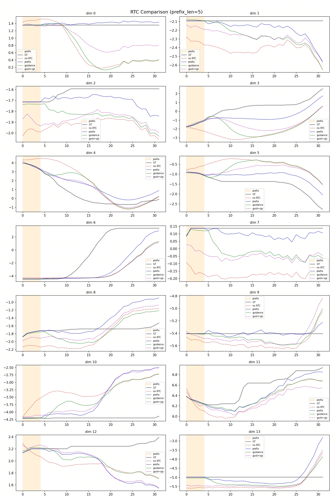

# RTC (Real-Time Chunking)

RTC (Real-Time Chunking) constrains the current denoising process with a known action prefix from previous predictions. This reduces inconsistencies between adjacent action chunks and improves trajectory continuity under asynchronous execution.

> **Reference**: [Physical Intelligence Kinetix — Real-Time Chunking](https://github.com/Physical-Intelligence/real-time-chunking-kinetix)

## Training-time RTC

### Method

Training-time RTC applies a shared prefix-conditioning principle to both training and inference:

- During training, the model is optimized under known-prefix constraints for consistent future-action prediction.
- During inference, prefix locking is applied to preserve cross-chunk continuity.

In this document, Training-time RTC means the combined setup of prefix-conditioned training and prefix-mode inference.

### Configuration

#### Training-side configuration

The placement of `rtc_training_config` depends on the model architecture:

**GR00T (FlowMatchingHead)** — add under `model.vla_head`:

```python
model = dict(
    vla_head=dict(
        rtc_training_config=dict(
            enabled=True,
            max_delay=7,
            distribution='exponential',  # 'exponential' (recommended) or 'uniform'
        )))
```

**PI0 (PI0FlowMatching)** — add directly under `model`:

```python
model = dict(
    type='PI0FlowMatching',
    rtc_training_config=dict(
        enabled=True,
        max_delay=7,
        distribution='exponential',  # 'exponential' (recommended) or 'uniform'
    ))
```

> **Note**: PI0.5 (`PI05FlowMatching`) does not support training-time RTC.

Mechanism: for each batch element, sample a delay `d ∈ [0, max_delay)`. The first `d` action steps are set to clean time (known no-noise states) and masked out from the loss.

#### Inference-side configuration

Use prefix mode in `rtc_config` and keep `async_execution=True`:

```python
inference = dict(
    type='AlohaRTCInferenceRunner',
    async_execution=True,
    execute_horizon=10,
    rtc_config=dict(
        enabled=True,
        method='prefix',
        prefix_len=5,
    ))
```

### Complete example

The following example uses GR00T deployed on ALOHA:

```python
_base_ = './gr00t/gr00t_eagle_3b_aloha_full_finetune.py'

# Training: enable RTC prefix conditioning
model = dict(
    vla_head=dict(
        rtc_training_config=dict(
            enabled=True,
            max_delay=7,
            distribution='exponential',
        )))

# Optional continued finetuning from a pretrained checkpoint
runner = dict(max_epochs=1)

# Inference: use prefix mode with async execution enabled
inference = dict(
    type='AlohaRTCInferenceRunner',
    async_execution=True,
    execute_horizon=10,
    rtc_config=dict(
        enabled=True,
        method='prefix',
        prefix_len=5,
    ))
```

## Test-time RTC

### Method

Test-time RTC is an inference-only guidance method:

- Training remains unchanged.
- During inference, guidance steers the denoising trajectory toward prefix-consistent outputs.
- Use this method when training was performed without RTC prefix conditioning.

In this document, Test-time RTC means the inference-only guidance setup.

### Configuration

Set guidance mode in `rtc_config` (with `async_execution=True`):

```python
inference = dict(
    type='AlohaRTCInferenceRunner',
    async_execution=True,
    execute_horizon=10,
    rtc_config=dict(
        enabled=True,
        method='guidance',
        prefix_len=5,
        decay_end=10,
        schedule='exp',
        max_guidance_weight=5.0,
        use_vjp=False,
    ))
```

### Difference from Training-time RTC

- Training-time RTC: modifies training and uses `method='prefix'` at inference.
- Test-time RTC: keeps training unchanged and uses `method='guidance'` at inference.
- In a single inference pass, `prefix` and `guidance` are typically used as alternative routes.

## Testing

The repository provides `scripts/test_rtc.py` to test and visualize RTC inference behavior. It:

- loads model weights from config + checkpoint,
- fetches one batch from the training dataset,
- uses ground-truth actions to simulate `prev_actions` (the prefix source in this test),
- runs selected RTC modes (configurable via `--modes`),
- outputs per-dimension denoising plots and comparison plots.

Available modes: `no_rtc`, `prefix`, `guidance`, `guidance_vjp`. All modes run by default.

Using GT as the prefix source keeps the prefix condition controlled and makes differences between RTC methods easier to compare.

Example commands:

```bash
# GR00T / PI0 — run all modes (default)
python scripts/test_rtc.py \
    --config configs/gr00t/gr00t_eagle_3b_aloha_full_finetune.py \
    --checkpoint /path/to/checkpoint.pt \
    --prefix_len 5 \
    --output_dir work_dirs/rtc_test

# PI0.5 — skip prefix mode (unsupported)
python scripts/test_rtc.py \
    --config configs/pi05/pi05_paligemma_aloha_full_finetune.py \
    --checkpoint /path/to/checkpoint.pt \
    --prefix_len 5 \
    --modes no_rtc guidance guidance_vjp
```

## Test visualization

<p align="center">
  
</p>

This figure compares trajectories from `no RTC`, `prefix`, `guidance`, and `guidance+vjp`.
The shaded prefix window marks the known-action region used during RTC inference.

Qualitative interpretation:

- In this figure, GT serves both as the reference trajectory and as the simulated prefix source for RTC.
- The `no RTC` curve serves as the unconstrained baseline.
- `prefix` mode (training-time RTC path) often follows a different trajectory from `no RTC` after the prefix window, indicating stronger prefix-conditioned continuation.
- `guidance` mode (test-time RTC path, including `guidance` and `guidance+vjp`) often stays closer to the `no RTC` baseline in later steps, while mainly improving the transition near the prefix-to-generation boundary.

This figure is intended as a qualitative reference for comparing post-prefix trajectory behavior between training-time RTC and test-time RTC.

## Supported models

| Model                    | Training-time RTC | Test-time RTC |
| ------------------------ | ----------------- | ------------- |
| FlowMatchingHead (GR00T) | ✅                | ✅            |
| PI0FlowMatching (PI0)    | ✅                | ✅            |
| PI05FlowMatching (PI0.5) | ❌                | ✅            |

> **Note**: PI0.5 does not support training-time RTC — its architecture
> cannot inject per-position timesteps without model modifications.
