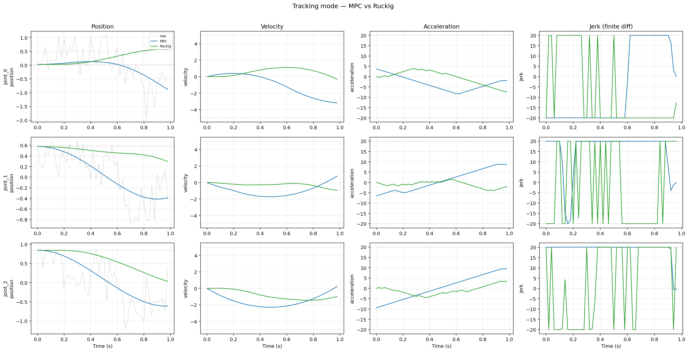
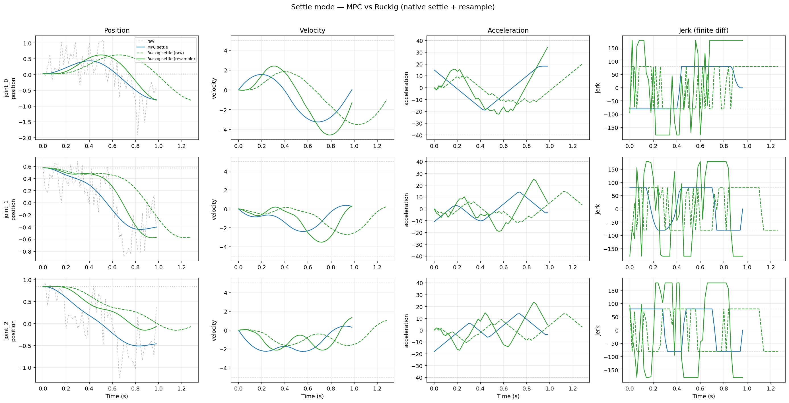
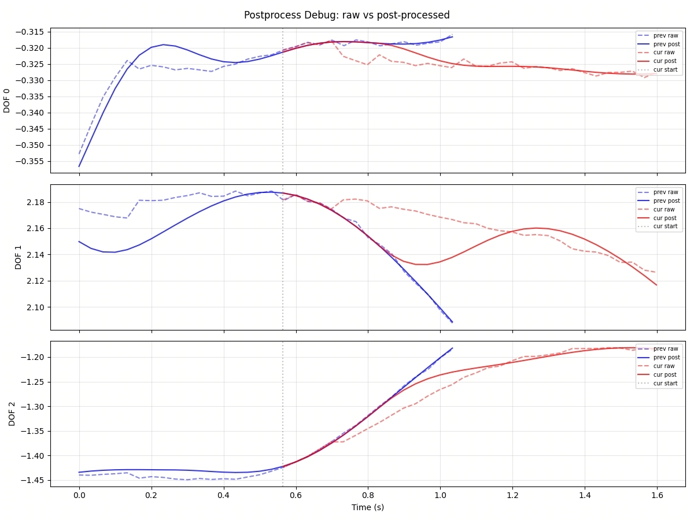

# 轨迹后处理

轨迹后处理位于策略模型与执行器之间，用于将模型输出的 action chunk 转换为更适合执行的轨迹。该模块不改变动作语义，主要处理速度、加速度、jerk 等高阶量的约束，以及 chunk 边界处的衔接问题。

## 问题

引入轨迹后处理，主要针对以下三类问题：

1. 模型直接输出的 action chunk 可能存在局部振荡，其隐含的速度、加速度和 jerk 可能偏大。
2. 相邻 chunk 单独观察时可能基本合理，但在拼接处仍可能出现可见的不连续。
3. 在异步执行场景下，上一段 chunk 往往已被控制器部分执行，因此新的 chunk 需要连接到当前真实执行状态，而不是直接替换上一段规划。

第一类问题对应 chunk 内部的高阶有界问题，第二类对应跨 chunk 的连续性问题，第三类对应带有时间偏移和部分执行历史的连续性问题。

## 思路

当前实现包含两部分：一是处理当前 chunk 内部的高阶有界问题，二是处理 chunk 之间的衔接问题。

### 基于优化的部分

这一部分直接作用于当前 chunk。输入为目标轨迹，输出为一段在速度、加速度和 jerk 上更受控的轨迹；在需要时，末端状态还可以被约束为更接近静止。

当前提供两类后端。

#### `joint_mpc`

`joint_mpc` 将每个关节的轨迹整理问题表述为带约束的优化问题，并使用 OSQP 求解。

其主要特性如下：

- 显式建模位置、速度、加速度和 jerk；
- 可以直接施加这些高阶量的约束；
- 对目标轨迹的跟踪能力较强；
- 计算密集度较高，耗时相对更长。

当前实现使用逐关节并行和 solver cache 复用来降低开销。
benchmark 统计时会先 warm-up，再计入正式时延。

对于 `joint_mpc`，`mode='settle'` 会为末端加入较轻的收敛偏置。

#### `ruckig_filter`

`ruckig_filter` 使用 Ruckig 作为 jerk-limited 在线轨迹生成器。

其主要特性如下：

- 实现较为直接，行为稳定；
- 更容易给出满足高阶约束的结果；
- 不保证对目标轨迹的严格跟踪；
- 会在轨迹层面引入一定滞后。

这里的“滞后”主要是指轨迹响应相对目标轨迹存在延后，而不是单次求解耗时更高。
Ruckig 在当前用法下更接近逐时刻推进，因此更容易稳定满足约束，但通常会带来一定参考跟踪滞后；`joint_mpc` 则在整个 horizon 上联合优化，因此通常能够实现更紧的目标跟踪，但计算开销也更高。

### Stitching 机制

Stitching 处理 chunk 之间的衔接问题，而不是当前 chunk 内部的优化问题。

启用 stitching 时，系统会：

1. 将上一段已处理轨迹重采样到当前 chunk 的前若干个时间点；
2. 直接将这些采样点作为当前 chunk 的前缀；
3. 从 stitching 边界之后继续求解余下部分。

该机制的作用是将当前 chunk 连接到真实执行历史，而不是将其视为一条全新轨迹。

### 与 RTC 的关系

Trajectory Postprocess 与 RTC 都可以改善跨 chunk 连续性，但两者工作的层次不同。

- RTC 作用于预测阶段，通过约束或引导模型生成过程，使当前 chunk 与已知动作前缀更一致；
- Trajectory Postprocess 作用于预测完成之后，重点处理执行侧的高阶量约束与边界衔接。

在实际系统中，两者可以同时使用：RTC 负责预测阶段的一致性，Trajectory Postprocess 负责执行阶段的高阶量约束与边界处理。

## 安装说明

后处理相关依赖需要在环境中显式安装。若当前环境未完整安装这些包，可手动执行：

```bash
pip install osqp ruckig matplotlib
```

说明如下：

- `osqp`：`joint_mpc` 后端所需；
- `ruckig`：`ruckig_filter` 后端所需；
- `matplotlib`：benchmark 绘图与调试可视化所需。

## 关键实现与可视化结果

实现位于 `fluxvla/engines/utils/postprocess/`。

- `Trajectory`：保存带时间戳的 positions、velocities 与 accelerations；
- `TrajectoryPostprocessor`：负责初始状态处理、stitching、后端分发与结果组装；
- `joint_mpc`：基于 OSQP 的逐关节优化后端；
- `ruckig_filter`：基于 Ruckig 的 jerk-limited filtering 后端；
- `plot_utils`：用于调试与对比的异步绘图工具。

运行时通过 `inference.postprocess_config` 配置，目前 `AlohaInferenceRunner` 和 `Tron2InferenceRunner` 均已支持。

### Tracking

Tracking 适用于滚动推理场景。此时控制器持续接收固定长度的 chunk，目标是在不要求末端静止的前提下，使近端轨迹满足高阶约束并尽快执行。

以下 benchmark 数值基于当前测试机，CPU 为 Intel Xeon Platinum 8336C @ 2.30GHz。

时延结果对应以下测试条件：

- 自由度：12
- horizon 长度：`N=50`

在当前工作区环境下，按 [scripts/benchmark_postprocess.py](scripts/benchmark_postprocess.py) 默认设置测得的平均 tracking latency 如下：

| 方法   | Tracking latency |
| ------ | ---------------- |
| MPC    | 4.9 ms           |
| Ruckig | 1.17 ms          |



该图比较了 tracking 模式下的 raw targets、`joint_mpc` 与 `ruckig`。

需要说明的要点如下：

1. 两种方法都能够基本满足速度、加速度和 jerk 的边界约束。
2. `joint_mpc` 对目标轨迹的跟踪能力更强，位置轨迹通常更接近 raw target。
3. `ruckig` 相比 `joint_mpc` 会引入更明显的滞后，但在实践中这种滞后未必会带来问题，仍需结合具体任务与控制器判断。

### Settle

Settle 适用于单帧推理场景。此时更关注单段轨迹作为一个完整动作段的执行效果，而不是依赖下一段 chunk 立即接管。

当前实现中：

- `joint_mpc` 通过 `mode='settle'` 在原始固定长度 horizon 内加入较轻的 terminal 和 settle 权重；
- `ruckig` 通过 `max_settle_steps` 在最后一个目标点之后继续推进，并在默认情况下通过 `resample_settle=True` 返回固定长度结果。



`R raw` 与 `R rsmpl` 表示同一条 Ruckig settle 轨迹的两种观察方式：

- `R raw` 保留自然延长后的 settle 结果；
- `R rsmpl` 将其重新采样回原始 horizon。

采用 `resample` 的原因在于，当前 postprocessor 与 runner 都按固定长度 chunk 工作。

注意：resample 会将延长的 settle 轨迹压缩回原始时间网格，因此输出的速度、加速度和 jerk 可能超过配置的限制。

### Stitching

Stitching 适用于异步执行场景，即当前 chunk 到达时，上一段 chunk 已经被部分执行。



这张 runtime plot 用于说明 stitching 机制，可通过 `debug_plot=True` 获得。按照当前实现，stitch 结果在拼接边界处对位置、速度和加速度保持连续；从离散采样角度看，可将其理解为边界处保持了 C2 连续性。stitch 结果在交接处与上一帧轨迹衔接更自然，而未启用 stitching 的结果更容易出现明显偏折。

## 配置

目前 `AlohaInferenceRunner` 和 `Tron2InferenceRunner` 已支持轨迹后处理，其他 runner 可以参考这两个实现自行适配。

下文仅给出 tracking 与 settle 两类常见配置。

### Tracking

Tracking 场景通常对应异步执行，因此建议 `async_execution=True`，并启用 stitching。推荐配置如下：

```python
inference = dict(
    type='AlohaInferenceRunner',
    async_execution=True,
    execute_horizon=10,
    postprocess_config=dict(
        enabled=True,
        method='joint_mpc',
        mode='tracking',
        num_stitch=6,
        max_velocity=5.0,
        max_acceleration=20.0,
        max_jerk=20.0,
        tracking_weight=3.0,
    ))
```

如需在线调试，可启用绘图：

```python
inference = dict(
    type='AlohaInferenceRunner',
    async_execution=True,
    execute_horizon=10,
    postprocess_config=dict(
        enabled=True,
        method='joint_mpc',
        mode='tracking',
        num_stitch=6,
        max_velocity=5.0,
        max_acceleration=20.0,
        max_jerk=20.0,
        tracking_weight=3.0,
        debug_plot=True,
        debug_plot_dofs=[0, 1, 2],
    ))
```

### Settle

Settle 场景通常对应单帧推理，因此建议关闭异步执行，即 `async_execution=False`。

```python
inference = dict(
    type='AlohaInferenceRunner',
    async_execution=False,
    execute_horizon=10,
    postprocess_config=dict(
        enabled=True,
        method='joint_mpc',
        mode='settle',
        num_stitch=0,
        max_velocity=5.0,
        max_acceleration=40.0,
        max_jerk=80.0,
        terminal_weight=1.0,
        settle_weight=1.0,
    ))
```

对于基于 OSQP 的 `joint_mpc` settle 模式，静止启停通常需要更宽松的限制；
`max_acceleration=40.0`、`max_jerk=80.0` 可作为实用起点。
`terminal_weight` 和 `settle_weight` 控制末端收敛与目标跟踪之间的权衡；当前默认值均为 1.0，属于较轻的收尾偏置。

如需使用 Ruckig 的 settle 行为：

```python
inference = dict(
    type='AlohaInferenceRunner',
    async_execution=False,
    execute_horizon=10,
    postprocess_config=dict(
        enabled=True,
        method='ruckig',
        mode='settle',
        num_stitch=0,
        max_velocity=5.0,
        max_acceleration=40.0,
        max_jerk=80.0,
        max_settle_steps=15,
    ))
```

## 适配分析

`AlohaInferenceRunner` 和 `Tron2InferenceRunner` 已有完整的后处理实现，可以直接参考。往新机器人或新 runner 上接入时，重点考虑以下问题。

### 1. 底层控制接口

是否需要引入轨迹后处理，首先取决于机器人底层控制接口的形式。不同平台提供的 movej、servoj、MIT 控制或力控接口在时间语义、闭环方式和执行侧平滑能力上并不相同，因此应结合底层执行机制判断是否需要额外后处理。

### 2. 受控 DOF 的选择

并不是所有输出维度都适合进入同一条后处理路径。

- 机械臂关节通常适合连续后处理；
- 夹爪、吸盘状态或其他离散通道通常需要单独处理。

### 3. 同步与异步执行模式

是否需要 stitching，与执行模式直接相关。

- 同步执行下，通常优先使用 settle；
- 异步执行下，通常优先使用 tracking + stitching，并重点验证边界区域的连续性。

### 4. 机器人侧保护逻辑

轨迹后处理负责生成更适合执行的轨迹；机器人本体与 runner 中已有的保护逻辑仍需保留。接入时应确认后处理结果不会破坏现有的限幅、急停与执行保护流程。

### 5. 限制参数调优

`max_velocity`、`max_acceleration`、`max_jerk` 控制跟踪能力与运动平滑性之间的权衡。限制更紧时，轨迹通常更保守、更平滑，但跟踪更弱；限制更松时，目标跟踪更紧，但动作也会更激进。应结合硬件特性调参，并通过 `debug_plot` 观察实际后处理轨迹。

推荐起始值：

| 模式     | `max_acceleration` | `max_jerk` |
| -------- | ------------------ | ---------- |
| tracking | 20.0               | 20.0       |
| settle   | 40.0               | 80.0       |
